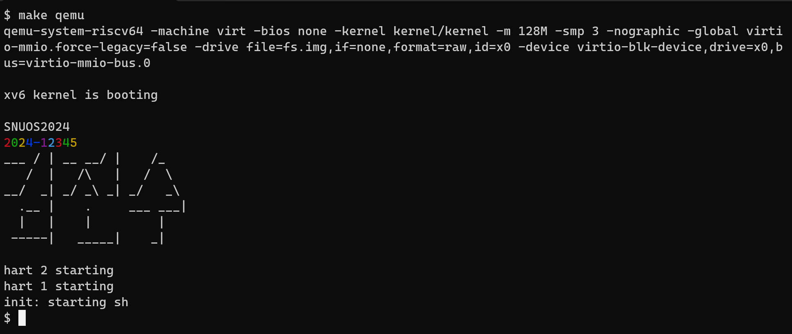

# 4190.307 Operating Systems (Spring 2024)
# Project #1: Hello world, xv6
### Due: 11:59 PM, March 18 (Monday)

## Introduction

`xv6` is an instructional operating system developed by MIT based on Ken Thompson and Dennis Ritchie's Unix version 6 (v6). In this course, we will use `xv6-riscv`, a version recently ported to a multi-core RISC-V machine. The goal of this project is to set up your development environment on Linux or macOS  and familiarize yourself with our project submission server.

## Problem specification

Modify the `xv6` kernel source code and print the string `SNUOS2024` on the screen, along with your student ID and your name, during the boot process, as shown in the following example. __Please be creative when you print your name and student ID!__



## Restrictions

* All should be printed right after the "`xv6 kernel is booting`" message before the shell is running. This means that you need to insert a code snippet into a file in the `xv6` kernel directory (i.e., somewhere in `./kernel`), not into a user-space program in the `./user` directory.

* You must include the string "`SNUOS2024`" in your output without any decoration because this will be used for automatic grading.

## Installing RISC-V Toolchain and QEMU

The installation of `xv6` requires the following steps:

* __GNU RISC-V toolchain__: You require the 64-bit RISC-V (RV64GC) GNU toolchain to compile the `xv6` source code.
* __QEMU for emulating a multi-core RISC-V machine__: In order to run `xv6` on a machine with x86_64 processors or Apple Silicon, you need to install the open source machine emulator called [QEMU](https://www.qemu.org).
* __xv6__: You need to build the kernel and the root file system image from the `xv6` source code.

We provide the detailed instructions on installing the GNU RISC-V toolchain and QEMU below for Ubuntu, Windows, and macOS.

### On Ubuntu

The following instructions are based on the latest stable [Ubuntu version 22.04.4 LTS](https://ubuntu.com/download/desktop).

#### 1. Install the prerequisite packages

```
$ sudo apt install git build-essential
```

#### 2. Install the RISC-V GNU Toolchain

Install the cross compiler for the 64-bit RISC-V processor as follows. Your GNU toolchain will be installed in the `/usr/bin` directory.

```
$ sudo apt install gcc-riscv64-linux-gnu
```

#### 3. Install QEMU for RISC-V machines

Install the `qemu-system-misc` package as follows. The executable file `/usr/bin/qemu-system-riscv64` is the 64-bit RISC-V machine emulator used by `xv6`.

```
$ sudo apt install qemu-system-misc
```

### On Windows

The easiest way of running `xv6` on Windows is to turn on the "Windows Subsystem for Linux (WSL)" and then install Ubuntu from the Microsoft Store. For detailed instructions, please refer to [this page](https://learn.microsoft.com/en-us/windows/wsl/install).

The latest Ubuntu version in the Microsoft Store is 22.04.3 LTS. Once you have installed Ubuntu 22.04.3 LTS, please follow the same steps as you would do for the above Ubuntu case.


### On macOS

The following instructions are based on the macOS Ventura or Sonoma.

#### 1. Install `xcode` command line tools

If your Mac does not have `xcode` command line tools, install them using the following command.

```
$ xcode-select --install
```

#### 2. Install the `homebrew` utility

If your Mac does not have the `homebrew` utility, a package manager for macOS, install it as follows.

```
$ /bin/bash -c "$(curl -fsSL https://raw.githubusercontent.com/Homebrew/install/master/install.sh)"
```

#### 3. Install the RISC-V GNU Toolchain

Now install the 64-bit RISC-V GNU toolchain using the `brew` command. This step may take a while.

```
$ brew tap riscv-software-src/riscv
$ brew install riscv-gnu-toolchain
```

The GNU RISC-V toolchain is installed in the `/opt/homebrew/bin` directory. If this directory is not listed in the `PATH` environment variable, please add the following two lines in your `~/.zshrc` file and restart your terminal (for `zsh` only).

```
path=('/opt/homebrew/bin' $path)
export path
```

#### 4. Install QEMU

Install QEMU using the `brew` utility.

```
$ brew install qemu
```

## Installing and Running xv6

### 1. Download xv6

The source code of `xv6` can be downloaded from https://github.com/snu-csl/xv6-riscv-snu using the following command.

```
$ cd ~
$ git clone https://github.com/snu-csl/xv6-riscv-snu
```

Note that this is merely a fork (with minor course-specific customization) of the original version maintained by MIT at https://github.com/mit-pdos/xv6-riscv.

### 2. Change to `pa1` branch

For this project assignment, you should work on the `pa1` branch. Please move to the `pa1` branch using the following command.

```
# cd xv6-riscv-snu
$ git checkout pa1
```

### 3. Modify the `Makefile`

Before you build `xv6`, you must change the `Makefile`. Set `STUDENTID` to your student ID in the fifth line of `xv6-riscv-snu/Makefile`.

Now you are ready to build the `xv6` kernel and the root file system image. Please take the following steps.

```
$ cd ~/xv6-riscv-snu
$ make
```

### 4. Run `xv6`

You can run `xv6` using the `make qemu` command. The output should look like this.

```
$ make qemu
qemu-system-riscv64 -machine virt -bios none -kernel kernel/kernel -m 3G -smp 3 -nographic -drive file=fs.img,if=none,format=raw,id=x0 -device virtio-blk-device,drive=x0,bus=virtio-mmio-bus.0

xv6 kernel is booting

hart 2 starting
hart 1 starting
init: starting sh
$
```

To terminate QEMU, please press `ctrl-a` and then `x` in your keyboard.

## `xv6` resources

For the design and implementation of `xv6`, please refer to the book [_xv6: a simple, Unix-like teaching operating system_](http://csl.snu.ac.kr/courses/4190.307/2024-1/book-riscv-rev3.pdf). You may also find the following RISC-V specifications useful, on which `xv6` is based.

* [RISC-V Instruction Set Manual Volume I: User-Level ISA Version 20191213](http://csl.snu.ac.kr/courses/4190.307/2024-1/riscv-spec-20191213.pdf)
* [RISC-V Instruction Set Manual Volume II: Privileged Architecture Version 20211203](http://csl.snu.ac.kr/courses/4190.307/2024-1/riscv-privileged-20211203.pdf)


## Hand in instructions

* To submit your solution, you need to register an account to the submission server at https://sys.snu.ac.kr
  * You must enter your real name and student ID during registration
  * Wait for approval from the TA

* You need to upload the following two files.
  * Perform the `make submit` command in your `xv6-riscv-snu` directory. This will generate a compressed tar file name `xv6-{PANUM}-{STUDENTID}.tar.gz` in the `../xv6-riscv-snu` directory. Upload this file to the submission server.
  * Take a screenshot of your terminal that shows "SNUOS2024" along with your student ID and name. Convert the screenshot into a PDF file and upload it to the submission server as a report for this project assignment.

* Note that the submission server is only accessible inside the SNU campus network. If you want off-campus access (from home, cafe, etc.), you can add your IP address by submitting a Google Form whose URL is available in the eTL. Note that adding your new IP address is a ___manual___ process, so please do not expect it to be completed immediately.

## Logistics

* You will work on this project alone.
* Only the upload submitted before the deadline will receive the full credit. 25% of the credit will be deducted for every single day delay.
* __You can use up to _3 slip days_ during this semester__. If your submission is delayed by one day and if you decide to use one slip day, there will be no penalty. In this case, you should explicitly declare the number of slip days you want to use in the QnA board of the submission server right after each submission. Once slip days have been used, they cannot be canceled later, so saving them for later projects is highly recommended!
* Any attempt to copy others' work will result in a heavy penalty (for both the copier and the originator). Don't take a risk.

Have fun!

[Jin-Soo Kim](mailto:jinsoo.kim_AT_snu.ac.kr)
[Systems Software and Architecture Laboratory](http://csl.snu.ac.kr)
[Dept. of Computer Science and Engineering](http://cse.snu.ac.kr)
[Seoul National University](http://www.snu.ac.kr)
